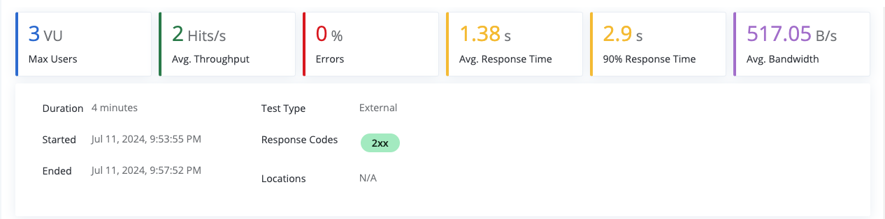
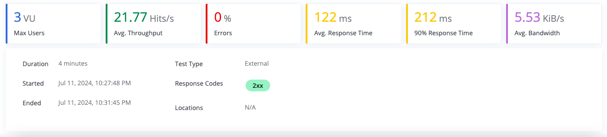

# Nameko Examples

## Airship Ltd
Buying and selling quality airships since 2012

## Performance Evaluation

### 1. Why is performance degrading as the test runs longer?

<br>

> In the gateway service, all existing products are put directly in the service's memory when creating and retrieving an order. <br> This is done when validating the products tied to the created/retrieved order.


<br>

This a twofold problem. The retrieval of all products in this context is an unnecessary O(n) (n is the number of products) operation in terms of time complexity.
This operation becomes increasingly costly as the number of products grows, degrading the performance of the service. On top of that, the "n" products are also put in the service's memory unnecessarily (O(n) space complexity). With enough threads supplying a request spike, pulling the "n" products several times would lead to memory contingency. Worse yet, an arbitrarily large number of products might even crash the service.

----

### 2. How do we fix it?

#### 2.1 "Get Order" endpoint

In "get order" all products are put into memory when a single product is needed. This can be fixed by employing the ''get product" RPC call to retrieve the single relevant product instead.

#### 2.2 "Create Order" endpoint

In "create order" all products are retrieved to check if the products' IDs in the order details are valid/belong to an existing product. This can be aptly fixed by leveraging the product service's storage, as Redis natively provides an "exists" check:

* The product service would provide the feature to check whether a product ID is valid/belongs to an existing product with a dedicated RPC call.
* The "product exists" call would be used to check the order details's product IDs instead of retrieving all the products.

----

### 3. Results

The solution, further explanation, and the load test results in full can be found in the following Code Review: **[Enhance product retrieval in order-related calls](https://github.com/Benardi/nameko-devexp/pull/5)**

#### 3.1 Load Test Execution prior to change

* Covering endpoints `create product`, `create order`, `get product` and `get order`
* Starting from 600 products

<br>



#### 3.1 Load Test Execution after change

* Covering endpoints `create product`, `create order`, `get product` and `get order`
* Starting from 2300 products

<br>




#### **The solution has successfully solved the performance degradation!**
#### At 600 products the original service had an average response time of 1.38s. After applying my solution, I reduced the average response time to 122ms despite dealing with 2300 products. A decrease of 91.16% in average response time!  

<br>

> Observation: In the Load Tests above the requests "delete product" and "list orders" are not covered for clarity's sake.
> 
> * The request "delete product" reduces the number of products, hiding the degradation
> * The request "list orders" is by default O(n) in time complexity where "n" refers to the number of orders, and doesn't rely on products.
>
> In the Code Review **[Enhance product retrieval in order-related calls](https://github.com/Benardi/nameko-devexp/pull/5)** I've made available results covering all the endpoints!

<br>

## Prerequisites of setting up Development Environment

* [VSCode as IDE](https://code.visualstudio.com/download)
* [Docker](https://www.docker.com/)
* [Brew for OSX/Linux](https://brew.sh/)
* [Miniconda](https://docs.conda.io/en/latest/miniconda.html)

## Setup

### Setting up environment

* Install jq
```ssh
$ brew install jq
```
* Create conda environment
```ssh
$ conda env create -f environment_dev.yml
```
* To activate environment ()
```ssh
$ conda activate nameko-devex

// all commands after activation will have the right binaries references. You must always be in this environment to run and debug this project
```

* To deactivate environment
```ssh
$ conda deactivate nameko-devex

```
### Start services locally
* Activate conda environment using `conda activate nameko-devex`
* Start backing services as docker containers
```ssh
(nameko-devex) ./dev_run_backingsvcs.sh

// This will run rabbitmq, postgres and redis
```

* Start nameko services in one process (gateway, orders and products)
```ssh
(nameko-devex) ./dev_run.sh gateway.service orders.service products.service
```

* Quick `Smoke Test` to ensure the setup is working properly
```ssh
(nameko-devex) ./test/nex-smoketest.sh local 

# Example output:
Local Development
STD_APP_URL=http://localhost:8000
=== Creating a product id: the_odyssey ===
{"id": "the_odyssey"}
=== Getting product id: the_odyssey ===
{
  "in_stock": 10,
  "id": "the_odyssey",
  "maximum_speed": 5,
  "passenger_capacity": 101,
  "title": "The Odyssey"
}
=== Creating Order ===
{"id": 3}
=== Getting Order ===
{
  "order_details": [
    {
      "image": "http://www.example.com/airship/images/the_odyssey.jpg",
      "price": "100000.99",
      "product_id": "the_odyssey",
      "id": 3,
      "product": {
        "in_stock": 9,
        "id": "the_odyssey",
        "maximum_speed": 5,
        "passenger_capacity": 101,
        "title": "The Odyssey"
      },
      "quantity": 1
    }
  ],
  "id": 3
}
```

* Unit Test
```ssh
(nameko-devex) ./dev_pytest.sh
```

## Debugging via VSCode IDE

* Start nameko services in debugging mode

```ssh
(nameko-devex) DEBUG=1 ./dev_run.sh gateway.service orders.service products.service

// Same output
Connection to localhost port 15672 [tcp/*] succeeded!
Connection to localhost port 6379 [tcp/*] succeeded!
Connection to localhost port 5432 [tcp/postgresql] succeeded!
INFO  [alembic.runtime.migration] Context impl PostgresqlImpl.
INFO  [alembic.runtime.migration] Will assume transactional DDL.
{}

nameko service in debug mode. please connect to port 5678 to start service
```

* Attach debugging process via `Python Debug: Connect` in VSCode


## Performance Test via Taurus BlazeMeter locally

* Start nameko services
* Start performance script
```ssh
(nameko-devex) ./test/nex-bzt.sh local

// This will run by default 3 users, for 3 minutes with 1 minute ramp-up time
```


## FastAPI integration with nameko

[FastAPI](https://fastapi.tiangolo.com/) is a modern, fast web framework for building APIs with build-in integration with [SwaggerUI](https://petstore.swagger.io/) and [Redoc](https://redocly.github.io/redoc/) for testing APIs.
Essentially, `gateapi` module replaces `gateway` module for http endpoint development. Below are the instructions of enabling it.

* Start nameko processes + fastapi without __gateway__ service
```ssh
FASTAPI=X ./dev_run.sh orders.service products.service
```
Note that `gateway.service` module is missing as it is being replace by fastapi. For more details how fastapi was started, please read [run.sh](run.sh)

* Run smoketest and perf-test as usual. eg: `test/nex-smoketest.sh local` and `test/nex-bzt.sh local`

* Test API manually via [http://localhost:8000/docs], for redoc use: [http://localhost:8000/redoc]

* It will be useful checkout the different how to build http endpoints via nameko's [extension](https://nameko.readthedocs.io/en/stable/built_in_extensions.html#http) vs [fastapi](https://fastapi.tiangolo.com/tutorial/)

#### Integration between FastAPI and nameko via Depends

While nameko http service make it easy to call other nameko rpc/event services, [ClusterRpcProxyPool](gateapi/gateapi/api/dependencies.py) is created to make integration between FastAPI and Nameko seamless. Please checkout the different in implementation between gateway's [service.py](gateway/gateway/service.py) class with gateapi's [routers/order.py](gateapi/gateapi/api/routers/order.py) and [routers/product.py](gateapi/gateapi/api/routers/product.py)

## Deployment to Docker/K8S/CloudFoundry

Please refer to [README-DevOps.md](README-DevOps.md)